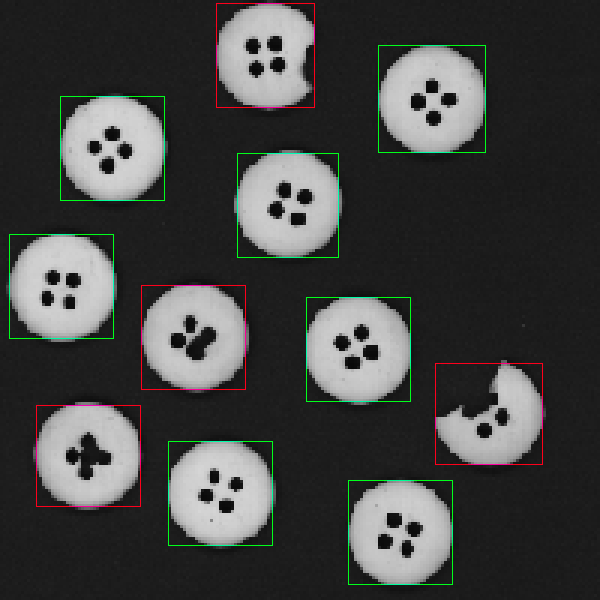

# Connected Component Detector

Detects and classifies connected regions in binary PPM images using flood-fill, then draws color-coded bounding boxes on the output. No external libraries.

---

## Overview

The program loads a black & white PPM image, finds every distinct blob of foreground pixels, measures each one, and writes an annotated copy of the image with bounding boxes drawn around each region.

Green boxes are regions that meet the size threshold. Red boxes are regions that fall below it and are flagged as damaged.

---

## Visual Results

GitHub does not render `.ppm` files. See the [Image Conversion](#image-conversion) section to convert before pushing.

| Input | Output |
|:-----:|:------:|
|  |  |

---

## How It Works

**1. Load the image**
Reads a P3 PPM file and stores each pixel in a 2D grid.

**2. Find connected regions**
Scans the grid pixel by pixel. When an unvisited foreground pixel is found, a depth-first flood-fill visits every connected neighbor (4-directional: up, down, left, right), grouping them all into one component.

**3. Track region data**
During the flood-fill, two things are recorded per component: the total pixel count, and the min/max row and column values. These give the size and bounding box in a single pass.

**4. Classify**
If a component's pixel count is below the threshold, it is marked damaged. Otherwise it passes.

**5. Draw bounding boxes**
A rectangle is drawn using the recorded min/max coordinates. Green for passing components, red for damaged ones.

**6. Write output**
The annotated grid is saved to a new PPM file.

---

## Core Idea

An image is a grid. A grid is a graph. Every foreground pixel is a node, and edges connect it to its four neighbors. Finding connected components is just finding the disconnected subgraphs inside that larger graph.

Flood-fill is DFS on that graph. Start at an unvisited node, visit every reachable neighbor recursively, and when the call stack unwinds the entire component has been mapped. Run that from every unvisited foreground pixel and every component gets labeled.

---

## Features

- Parses P3 PPM images without any image library
- Detects all connected components via DFS flood-fill
- Computes bounding boxes in a single traversal pass
- Classifies components by pixel area against a configurable threshold
- Annotates output with green/red bounding boxes
- Writes the result to a new PPM file
- No external dependencies

---

## Tech Stack

| | |
|---|---|
| Language | C++17 |
| Compiler | g++ 13.3.0 |
| Image format | PPM P3 |
| Algorithm | Depth-First Search (flood-fill) |
| Dependencies | None |

---

## Build and Run

```bash
g++ src/*.cpp -Iinclude -std=c++17 -o detector
```

```bash
./detector input.ppm output.ppm
```

---

## Image Conversion

**ImageMagick:**
```bash
convert input.ppm images/input.png
convert output.ppm images/output.png
```

**ffmpeg:**
```bash
ffmpeg -i input.ppm images/input.png
ffmpeg -i output.ppm images/output.png
```

Put the converted files in an `images/` folder at the repo root and the table above will render automatically.

---

## Project Structure

```
connected-component-detector/
├── src/
│   ├── main.cpp
│   ├── image.cpp
│   └── detector.cpp
├── include/
│   ├── image.h
│   └── detector.h
├── images/
│   ├── input.png
│   └── output.png
├── data/
│   └── Buttons.ppm
└── README.md
```

---

## Key Learnings

**Graphs are everywhere.** Treating a pixel grid as a graph makes the whole problem straightforward. The same DFS you would use on an adjacency list works here with almost no changes.

**Single-pass data collection.** Bounding boxes and pixel counts come out of the flood-fill for free. No second scan needed.

**Working without libraries.** Parsing PPM manually and drawing pixels by hand makes it obvious what image libraries are actually abstracting away.

---

## License

MIT
